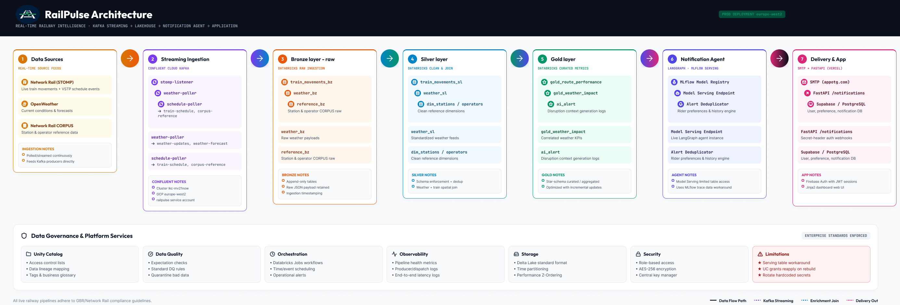

# Railpulse-Notification-Agent

Databricks Lakehouse and LangGraph notification agent for [RailPulse](https://github.com/Berachaiah/RailPulse2026) — ingests Network Rail and OpenWeather data through a Bronze/Silver/Gold medallion pipeline and dispatches disruption notifications to riders.

## 🖼️ Architecture Diagram

